# Rescue Robot — Architecture Diagrams

Diagram-first companion to [`SOFTWARE_ARCHITECTURE.md`](./SOFTWARE_ARCHITECTURE.md), which
contains the full prose rationale. This document renders every major view as a
diagram — system context, containers, components, runtime sequences, state
machines, data model, and deployment — with only enough text to label what
each diagram shows. Source of truth for field names, ports, and constants is
`pi/common/protocol.py`.

---

## 1. System Context

Who and what the system talks to, and what's outside its boundary.

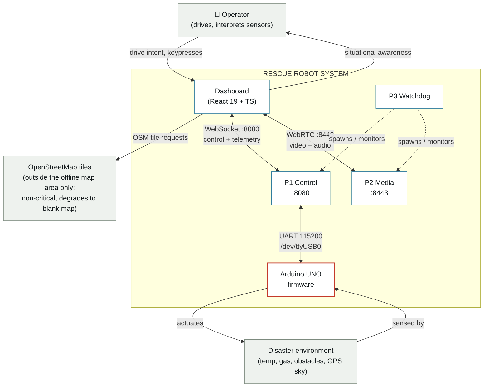
```mermaid
flowchart TB
    operator["🧑 Operator<br/>(drives, interprets sensors)"]
    osm["OpenStreetMap tiles<br/>(outside the offline map area only;<br/>non-critical, degrades to blank map)"]
    env["Disaster environment<br/>(temp, gas, obstacles, GPS sky)"]

    subgraph system["RESCUE ROBOT SYSTEM"]
        dashboard["Dashboard<br/>(React 19 + TS)"]
        p1["P1 Control<br/>:8080"]
        p2["P2 Media<br/>:8443"]
        p3["P3 Watchdog"]
        arduino["Arduino UNO<br/>firmware"]
    end

    operator -- "drive intent, keypresses" --> dashboard
    dashboard -- "situational awareness" --> operator
    dashboard -- "OSM tile requests" --> osm

    dashboard <-- "WebSocket :8080<br/>control + telemetry" --> p1
    dashboard <-- "WebRTC :8443<br/>video + audio" --> p2
    p3 -. "spawns / monitors" .-> p1
    p3 -. "spawns / monitors" .-> p2
    p1 <-- "UART 115200<br/>/dev/ttyUSB0" --> arduino
    arduino -- "actuates" --> env
    env -- "sensed by" --> arduino

    classDef ext fill:#eef2ee,stroke:#7C8A7E,color:#12181A;
    classDef core fill:#fff,stroke:#2F7C9E,color:#12181A;
    classDef safety fill:#fff,stroke:#C4392B,color:#12181A,stroke-width:2px;
    class operator,osm,env ext;
    class dashboard,p1,p2,p3 core;
    class arduino safety;
```

Only two transports cross the mission boundary: **WebSocket :8080** (control +
telemetry) and **WebRTC :8443** (video + audio). They fail independently — a
camera failure never touches the control path. The only outbound internet
dependency is OSM map tiles, and it is not mission-critical: inside the
operating area the map comes from `area.pmtiles` on the Pi, which P1 serves
at `/maps`, so the map works with no internet there.

WebRTC is two-way: the same connection carries the operator's voice, video
and messages back to the victim-facing Robot Screen — see §14.

---

## 2. Container View

Six independently deployable units, and — the most important column — who
restarts each one when it fails.

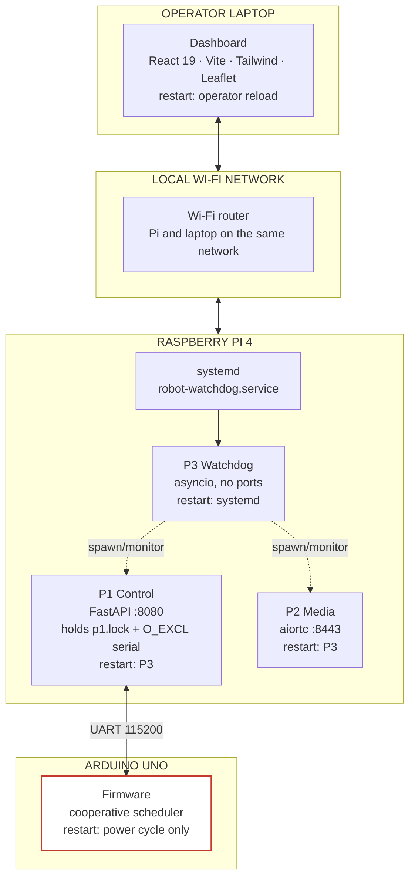
```mermaid
flowchart TB
    subgraph laptop["OPERATOR LAPTOP"]
        dash["Dashboard<br/>React 19 · Vite · Tailwind · Leaflet<br/>restart: operator reload"]
    end

    subgraph lan["LOCAL WI-FI NETWORK"]
        wifi["Wi-Fi router<br/>Pi and laptop on the same network"]
    end

    subgraph pi["RASPBERRY PI 4"]
        systemd["systemd<br/>robot-watchdog.service"]
        p3["P3 Watchdog<br/>asyncio, no ports<br/>restart: systemd"]
        p1["P1 Control<br/>FastAPI :8080<br/>holds p1.lock + O_EXCL serial<br/>restart: P3"]
        p2["P2 Media<br/>aiortc :8443<br/>restart: P3"]
    end

    subgraph mcu["ARDUINO UNO"]
        fw["Firmware<br/>cooperative scheduler<br/>restart: power cycle only"]
    end

    dash <--> lan
    lan <--> pi
    systemd --> p3
    p3 -. spawn/monitor .-> p1
    p3 -. spawn/monitor .-> p2
    p1 <-- "UART 115200" --> fw

    classDef restart_none fill:#fff,stroke:#C4392B,stroke-width:2px;
    class fw restart_none;
```

| Container | Runtime | Port / Device | Restart authority |
|---|---|---|---|
| Arduino firmware | AVR bare metal | UART 115200 | **None** — power cycle only |
| P1 control server | Python 3 / FastAPI | TCP 8080, `/dev/ttyUSB0`, `/dev/serial0` | P3 watchdog |
| P2 media server | Python 3 / aiortc | TCP 8443, `/dev/video0` | P3 watchdog |
| P3 watchdog | Python 3 / asyncio | — | systemd (`Restart=on-failure`) |
| Dashboard | Browser / React 19 | — | Operator reload |
| Wi-Fi network | Ordinary Wi-Fi router | Local network | Manual (power cycle the router) |

**Only P3 is a systemd unit.** P1 and P2 are its children, because systemd can
only see a process exit — it can't detect a process that's alive but wedged
on a blocking serial read. P3 catches that with an HTTP health poll.

---

## 3. Component View — P1 Control Server

P1 is the system's centre of gravity: sole UART owner, telemetry fan-out,
command validation.

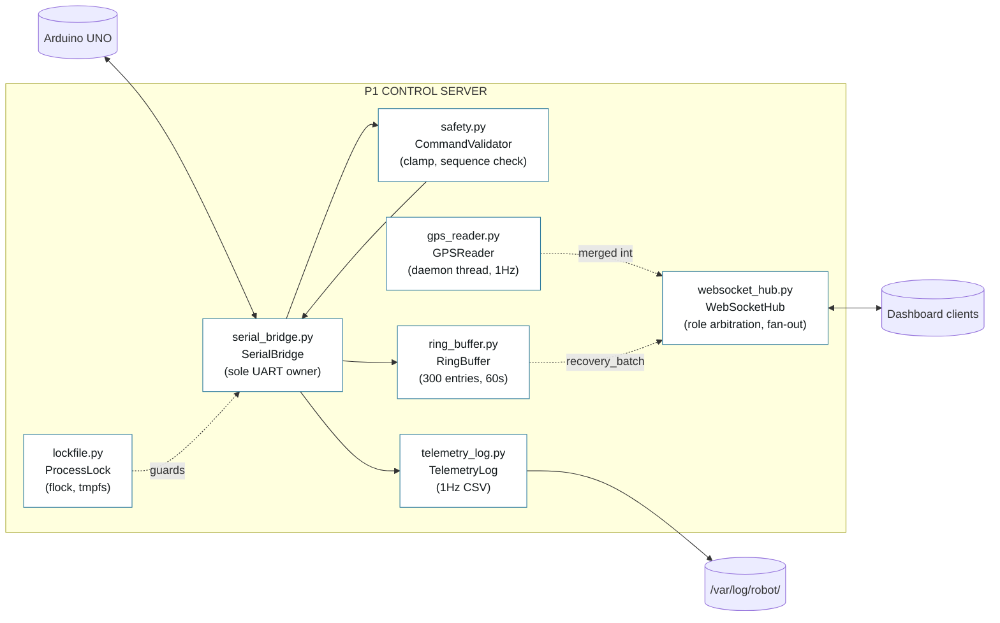
```mermaid
flowchart LR
    subgraph p1["P1 CONTROL SERVER"]
        direction TB
        lock["lockfile.py<br/>ProcessLock<br/>(flock, tmpfs)"]
        sb["serial_bridge.py<br/>SerialBridge<br/>(sole UART owner)"]
        safety["safety.py<br/>CommandValidator<br/>(clamp, sequence check)"]
        gps["gps_reader.py<br/>GPSReader<br/>(daemon thread, 1Hz)"]
        ring["ring_buffer.py<br/>RingBuffer<br/>(300 entries, 60s)"]
        hub["websocket_hub.py<br/>WebSocketHub<br/>(role arbitration, fan-out)"]
        tlog["telemetry_log.py<br/>TelemetryLog<br/>(1Hz CSV)"]
    end

    arduino[("Arduino UNO")]
    clients[("Dashboard clients")]
    disk[("/var/log/robot/")]

    arduino <--> sb
    lock -.guards.-> sb
    sb --> safety
    safety --> sb
    sb --> ring
    sb --> tlog --> disk
    gps -.merged into.-> hub
    ring -.recovery_batch.-> hub
    hub <--> clients

    classDef mod fill:#fff,stroke:#2F7C9E,color:#12181A;
    class lock,sb,safety,gps,ring,hub,tlog mod;
```

| Module | Type | Responsibility |
|---|---|---|
| `serial_bridge.py` | `SerialBridge` | Sole UART owner; handshake, frame ingest, command egress |
| `websocket_hub.py` | `WebSocketHub`, `Client` | Client registry, role arbitration, concurrent broadcast |
| `gps_reader.py` | `GPSReader` | Threaded NMEA parsing, track accumulation, GeoJSON export |
| `ring_buffer.py` | `RingBuffer` | 300-entry history; `since()` / `gap_ms()` for replay |
| `safety.py` | `CommandValidator` | Server-side clamp, sequence monotonicity |
| `telemetry_log.py` | `TelemetryLog` | 1 Hz, 19-column CSV with packed alert bitfield |
| `lockfile.py` | `ProcessLock` | Advisory `flock` enforcing the single-writer invariant |

---

## 4. Firmware Scheduler — Cooperative, Priority-Tiered

No RTOS, no threads. Three categories share one `loop()`, ordered so nothing
can starve the safety path.

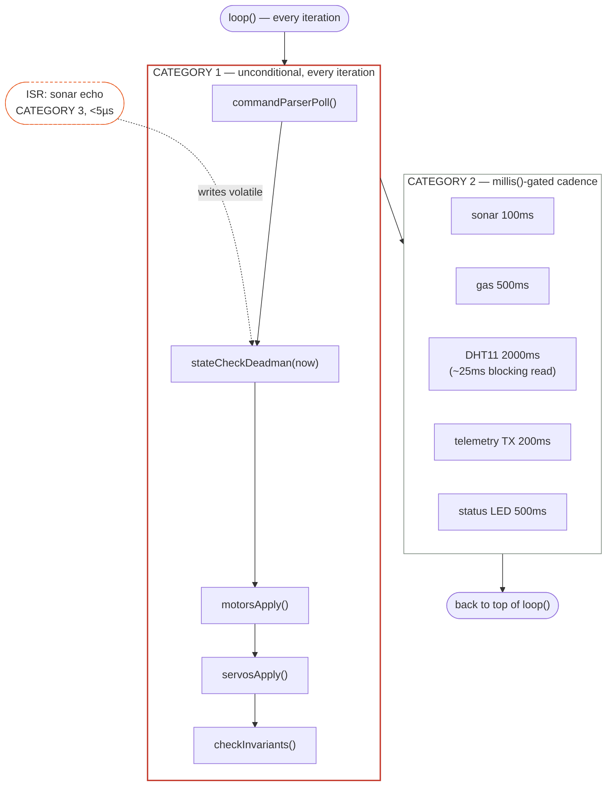
```mermaid
flowchart TD
    start(["loop() — every iteration"]) --> c1

    subgraph c1["CATEGORY 1 — unconditional, every iteration"]
        direction LR
        parse["commandParserPoll()"] --> dead["stateCheckDeadman(now)"] --> mot["motorsApply()"] --> srv["servosApply()"] --> inv["checkInvariants()"]
    end

    c1 --> c2

    subgraph c2["CATEGORY 2 — millis()-gated cadence"]
        direction LR
        sonar["sonar 100ms"]
        gas["gas 500ms"]
        dht["DHT11 2000ms<br/>(~25ms blocking read)"]
        tel["telemetry TX 200ms"]
        led["status LED 500ms"]
    end

    c2 --> loopback(["back to top of loop()"])

    isr1(["ISR: sonar echo<br/>CATEGORY 3, &lt;5µs"]) -.writes volatile.-> dead

    classDef safety fill:#fff,stroke:#C4392B,stroke-width:2px;
    classDef cadence fill:#fff,stroke:#7C8A7E;
    classDef isr fill:#fff,stroke:#E85A20,stroke-dasharray: 4 3;
    class c1 safety;
    class c2 cadence;
    class isr1 isr;
```

The DHT11's 2000 ms cadence is set specifically because its ~25 ms blocking
read must stay far below the 2000 ms dead-man window — Category 2 work bounds
the worst case latency of Category 1's safety check.

---

## 5. Firmware State Machine

Three states. `STOPPED` is a one-way trap door — reachable only through a
panic, and cleared only by a hardware reset.

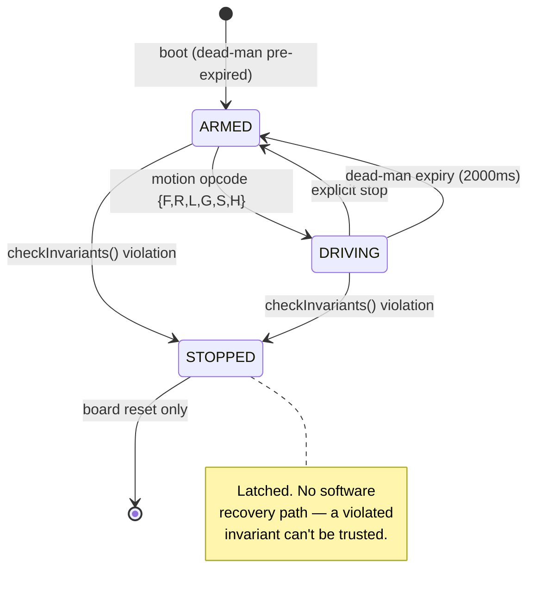
```mermaid
stateDiagram-v2
    [*] --> ARMED: boot (dead-man pre-expired)
    ARMED --> DRIVING: motion opcode {F,R,L,G,S,H}
    DRIVING --> ARMED: explicit stop
    DRIVING --> ARMED: dead-man expiry (2000ms)
    ARMED --> STOPPED: checkInvariants() violation
    DRIVING --> STOPPED: checkInvariants() violation
    STOPPED --> [*]: board reset only

    note right of STOPPED
        Latched. No software
        recovery path — a violated
        invariant can't be trusted.
    end note
```

---

## 6. Mission State (Operator-Visible)

Derived identically on the dashboard and by convention on P1 — a pure
function of current inputs, evaluated as first-match rules.

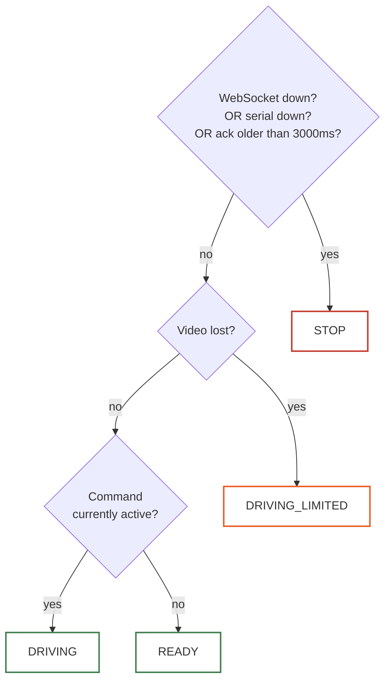
```mermaid
flowchart TD
    check1{"WebSocket down?<br/>OR serial down?<br/>OR ack older than 3000ms?"}
    check2{"Video lost?"}
    check3{"Command<br/>currently active?"}

    check1 -- yes --> STOP["STOP"]
    check1 -- no --> check2
    check2 -- yes --> LIMITED["DRIVING_LIMITED"]
    check2 -- no --> check3
    check3 -- yes --> DRIVING["DRIVING"]
    check3 -- no --> READY["READY"]

    classDef stop fill:#fff,stroke:#C4392B,stroke-width:2px;
    classDef limited fill:#fff,stroke:#E85A20,stroke-width:2px;
    classDef ok fill:#fff,stroke:#3E7D4C,stroke-width:2px;
    class STOP stop;
    class LIMITED limited;
    class DRIVING,READY ok;
```

---

## 7. Sequence — Startup Handshake

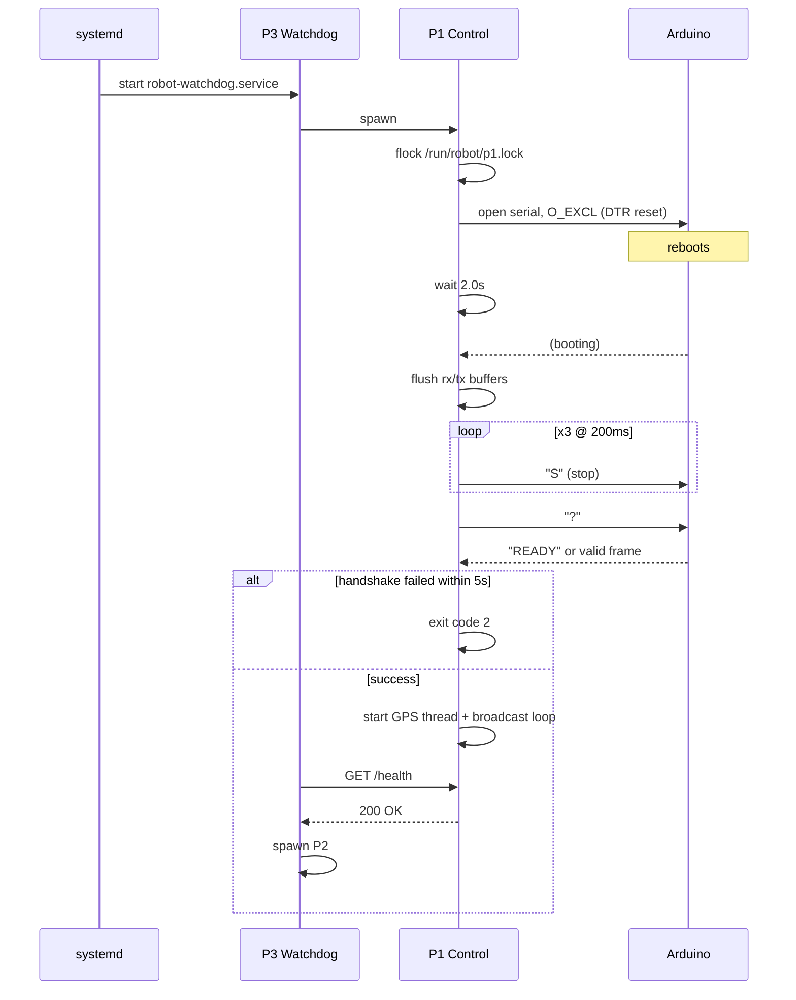
```mermaid
sequenceDiagram
    participant SD as systemd
    participant P3 as P3 Watchdog
    participant P1 as P1 Control
    participant AR as Arduino

    SD->>P3: start robot-watchdog.service
    P3->>P1: spawn
    P1->>P1: flock /run/robot/p1.lock
    P1->>AR: open serial, O_EXCL (DTR reset)
    Note over AR: reboots
    P1->>P1: wait 2.0s
    AR-->>P1: (booting)
    P1->>P1: flush rx/tx buffers
    loop x3 @ 200ms
        P1->>AR: "S" (stop)
    end
    P1->>AR: "?"
    AR-->>P1: "READY" or valid frame
    alt handshake failed within 5s
        P1->>P1: exit code 2
    else success
        P1->>P1: start GPS thread + broadcast loop
        P3->>P1: GET /health
        P1-->>P3: 200 OK
        P3->>P3: spawn P2
    end
```

The triple stop exists because if P1 crashed mid-drive, a single command
could be lost to a partially-flushed buffer during reset — three tries at
200 ms intervals close that gap even though the dead-man would also catch it.

---

## 8. Sequence — 200ms Telemetry Cycle

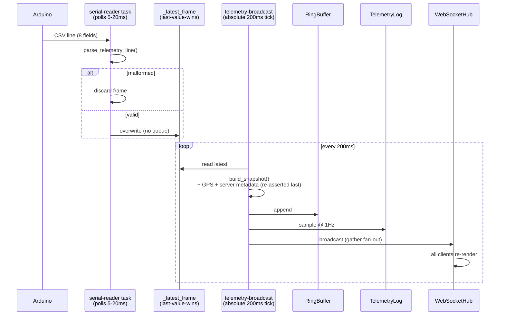
```mermaid
sequenceDiagram
    participant AR as Arduino
    participant SR as serial-reader task<br/>(polls 5-20ms)
    participant LF as _latest_frame<br/>(last-value-wins)
    participant TB as telemetry-broadcast<br/>(absolute 200ms tick)
    participant RB as RingBuffer
    participant TL as TelemetryLog
    participant WS as WebSocketHub

    AR->>SR: CSV line (8 fields)
    SR->>SR: parse_telemetry_line()
    alt malformed
        SR->>SR: discard frame
    else valid
        SR->>LF: overwrite (no queue)
    end

    loop every 200ms
        TB->>LF: read latest
        TB->>TB: build_snapshot()<br/>+ GPS + server metadata (re-asserted last)
        TB->>RB: append
        TB->>TL: sample @ 1Hz
        TB->>WS: broadcast (gather fan-out)
        WS->>WS: all clients re-render
    end
```

The reader and broadcaster share only a single last-value-wins slot — no
queue — which is what decouples the two rates: a serial stall can't block
the broadcast, and a slow broadcast can't back up the UART.

---

## 9. Sequence — Motor Command, Dual Validation

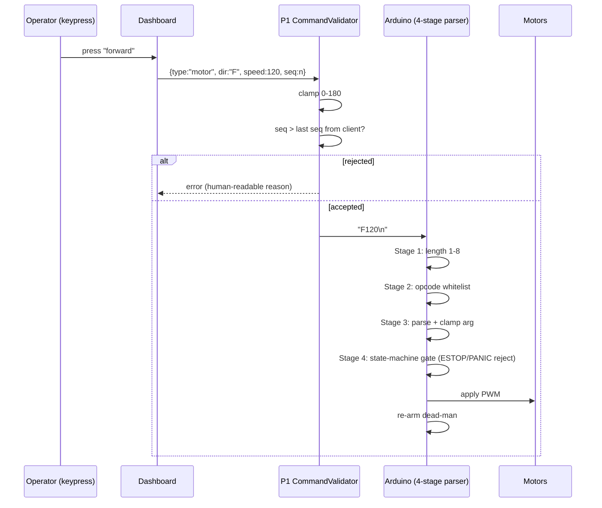
```mermaid
sequenceDiagram
    participant OP as Operator (keypress)
    participant DASH as Dashboard
    participant P1V as P1 CommandValidator
    participant AR as Arduino (4-stage parser)
    participant MOT as Motors

    OP->>DASH: press "forward"
    DASH->>P1V: {type:"motor", dir:"F", speed:120, seq:n}
    P1V->>P1V: clamp 0-180
    P1V->>P1V: seq > last seq from client?
    alt rejected
        P1V-->>DASH: error (human-readable reason)
    else accepted
        P1V->>AR: "F120\n"
        AR->>AR: Stage 1: length 1-8
        AR->>AR: Stage 2: opcode whitelist
        AR->>AR: Stage 3: parse + clamp arg
        AR->>AR: Stage 4: state-machine gate (ESTOP/PANIC reject)
        AR->>MOT: apply PWM
        AR->>AR: re-arm dead-man
    end
```

`stop_all` bypasses the sequence check entirely — a stop must never be
dropped for arriving "out of order."

The HC-SR04 range reading is not part of this path. It travels a separate,
read-only route — `HC-SR04 → range measurement → telemetry → P1 → dashboard
→ obstacle warning` — that only ever informs the operator; it never
intercepts or blocks a motor command.

---

## 10. Data Model — Protocol Contract

The wire protocol is the *only* real coupling between the four tiers. Defined
canonically in `pi/common/protocol.py`, hand-mirrored into `protocol.h` and
`protocol.ts`.

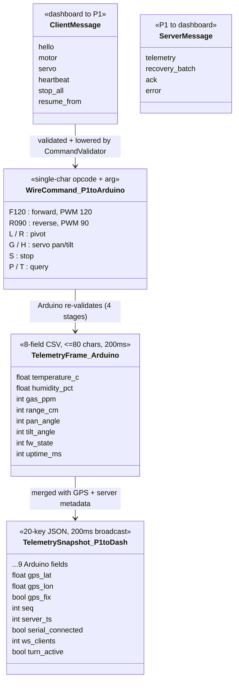
```mermaid
classDiagram
    class TelemetryFrame_Arduino {
        <<8-field CSV, <=80 chars, 200ms>>
        float temperature_c
        float humidity_pct
        int gas_ppm
        int range_cm
        int pan_angle
        int tilt_angle
        int fw_state
        int uptime_ms
    }

    class TelemetrySnapshot_P1toDash {
        <<20-key JSON, 200ms broadcast>>
        ...9 Arduino fields
        float gps_lat
        float gps_lon
        bool gps_fix
        int seq
        int server_ts
        bool serial_connected
        int ws_clients
        bool turn_active
    }

    class ClientMessage {
        <<dashboard to P1>>
        hello
        motor
        servo
        heartbeat
        stop_all
        resume_from
    }

    class ServerMessage {
        <<P1 to dashboard>>
        telemetry
        recovery_batch
        ack
        error
    }

    class WireCommand_P1toArduino {
        <<single-char opcode + arg>>
        F120 : forward, PWM 120
        R090 : reverse, PWM 90
        L / R : pivot
        G / H : servo pan/tilt
        S : stop
        P / T : query
    }

    TelemetryFrame_Arduino --> TelemetrySnapshot_P1toDash : merged with GPS + server metadata
    ClientMessage --> WireCommand_P1toArduino : validated + lowered by CommandValidator
    WireCommand_P1toArduino --> TelemetryFrame_Arduino : Arduino re-validates (4 stages)
```

**Discard-don't-retransmit** is the data architecture's defining rule: there
is no ACK, no sequence numbering, and no retry on the UART link. A corrupt
frame is dropped; the next one arrives within 200 ms.

| Store | Medium | Retention | Purpose |
|---|---|---|---|
| Ring buffer | Memory, 300 entries | 60 s @ 200 ms | `resume_from` replay after reconnect |
| `telemetry.log` | Disk CSV, 19 columns | Daily rotation, 7 kept | Post-mission analysis @ 1 Hz |
| `p{1,2,3}_events.log` | Disk, structured text | Weekly rotation, 8 kept | Fault diagnosis, audit |
| GeoJSON track | Disk, per session | 90 days (cron) | Mission path reconstruction |

---

## 11. Failure Modes → Detection → Recovery

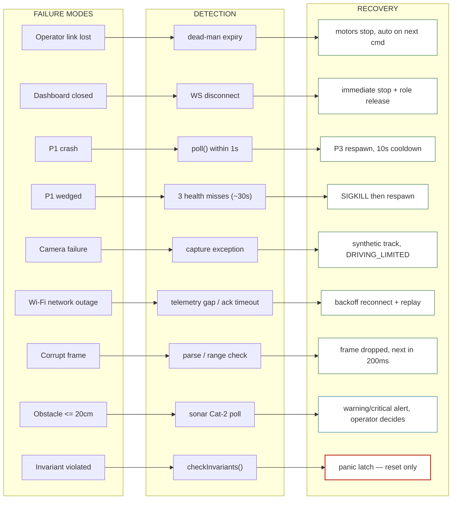
```mermaid
flowchart LR
    subgraph faults["FAILURE MODES"]
        f1["Operator link lost"]
        f2["Dashboard closed"]
        f3["P1 crash"]
        f4["P1 wedged"]
        f5["Camera failure"]
        f6["Wi-Fi network outage"]
        f7["Corrupt frame"]
        f8["Obstacle <= 20cm"]
        f9["Invariant violated"]
    end

    subgraph detect["DETECTION"]
        d1["dead-man expiry"]
        d2["WS disconnect"]
        d3["poll() within 1s"]
        d4["3 health misses (~30s)"]
        d5["capture exception"]
        d6["telemetry gap / ack timeout"]
        d7["parse / range check"]
        d8["sonar Cat-2 poll"]
        d9["checkInvariants()"]
    end

    subgraph recover["RECOVERY"]
        r1["motors stop, auto on next cmd"]
        r2["immediate stop + role release"]
        r3["P3 respawn, 10s cooldown"]
        r4["SIGKILL then respawn"]
        r5["synthetic track, DRIVING_LIMITED"]
        r6["backoff reconnect + replay"]
        r7["frame dropped, next in 200ms"]
        r8["warning/critical alert, operator decides"]
        r9["panic latch — reset only"]
    end

    f1-->d1-->r1
    f2-->d2-->r2
    f3-->d3-->r3
    f4-->d4-->r4
    f5-->d5-->r5
    f6-->d6-->r6
    f7-->d7-->r7
    f8-->d8-->r8
    f9-->d9-->r9

    classDef auto fill:#fff,stroke:#3E7D4C;
    classDef manual fill:#fff,stroke:#C4392B,stroke-width:2px;
    classDef advisory fill:#fff,stroke:#2F7C9E;
    class r1,r2,r3,r4,r5,r6,r7 auto;
    class r9 manual;
    class r8 advisory;
```

Every fault recovers automatically except a panic latch — deliberately, since
automatic recovery from a falsified invariant can't be trusted.

---

## 12. Deployment Layout

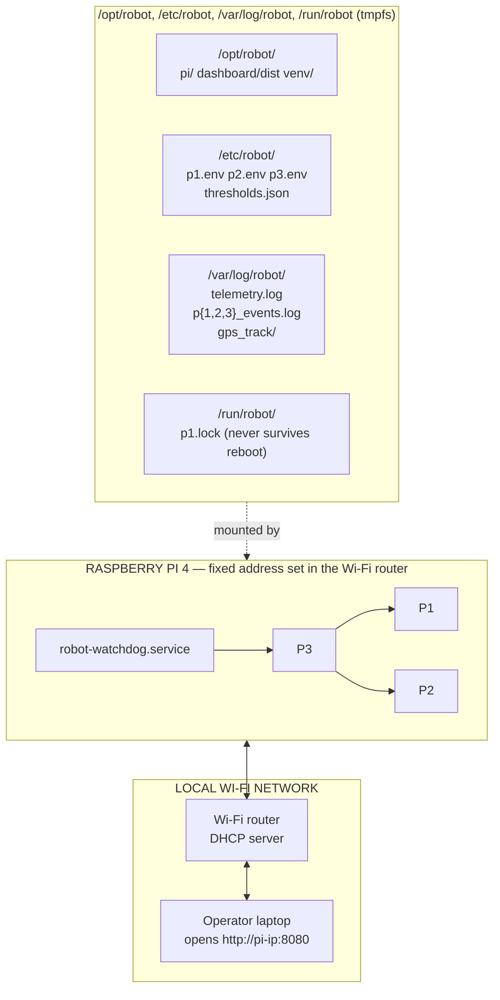
```mermaid
flowchart TB
    subgraph fs["/opt/robot, /etc/robot, /var/log/robot, /run/robot (tmpfs)"]
        opt["/opt/robot/<br/>pi/ dashboard/dist venv/"]
        etc["/etc/robot/<br/>p1.env p2.env p3.env<br/>thresholds.json"]
        log["/var/log/robot/<br/>telemetry.log<br/>p{1,2,3}_events.log<br/>gps_track/"]
        run["/run/robot/<br/>p1.lock (never survives reboot)"]
    end

    subgraph pi4["RASPBERRY PI 4 — fixed address set in the Wi-Fi router"]
        svc["robot-watchdog.service"] --> p3s["P3"] --> p1s["P1"] & p2s["P2"]
    end

    subgraph lan["LOCAL WI-FI NETWORK"]
        n1["Wi-Fi router<br/>DHCP server"]
        op["Operator laptop<br/>opens http://pi-ip:8080"]
    end

    fs -.mounted by.-> pi4
    pi4 <--> n1
    n1 <--> op
```

`install.sh` is an idempotent eight-stage script: install packages → create
`robot` user (`dialout`, `video`, `audio` groups) → rsync code → build
venv → copy config templates *only where absent* → register systemd unit +
logrotate → print manual steps (GPS UART enable, verify serial
device).

---

## 13. Resolved Specification Contradictions

Where the two source methodology documents disagreed, the build picked one
default and made it configurable.

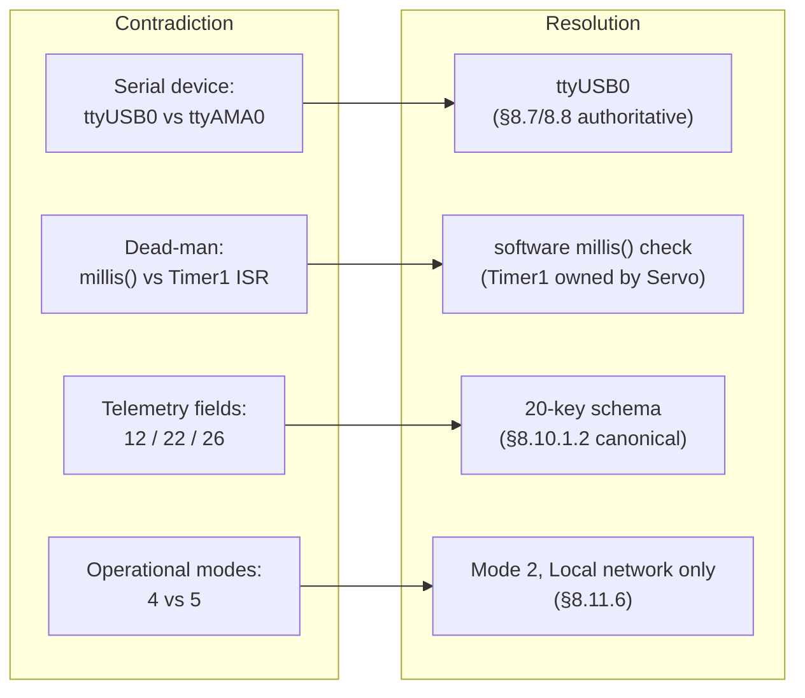
```mermaid
flowchart LR
    subgraph issues["Contradiction"]
        i1["Serial device:<br/>ttyUSB0 vs ttyAMA0"]
        i4["Dead-man:<br/>millis() vs Timer1 ISR"]
        i6["Telemetry fields:<br/>12 / 22 / 26"]
        i7["Operational modes:<br/>4 vs 5"]
    end
    subgraph resolved["Resolution"]
        r1["ttyUSB0<br/>(§8.7/8.8 authoritative)"]
        r4["software millis() check<br/>(Timer1 owned by Servo)"]
        r6["20-key schema<br/>(§8.10.1.2 canonical)"]
        r7["Mode 2, Local network only<br/>(§8.11.6)"]
    end
    i1-->r1
    i4-->r4
    i6-->r6
    i7-->r7
```

| Contradiction | Resolution | Configurable at |
|---|---|---|
| Serial device `ttyUSB0` vs `ttyAMA0` | `ttyUSB0` (§8.7/8.8 authoritative) | `p1.env: SERIAL_PORT` |
| Dead-man: `millis()` vs Timer1 ISR | Software check — Timer1 owned by Servo lib | `DEADMAN_MS` |
| Telemetry field count (12/22/26) | 20-key schema of §8.10.1.2 | `pi/common/protocol.py` |
| Operational mode count | Mode 2, Local network only (§8.11.6) | `p3.env: ENABLE_OVERLAY=0` |

---

## 14. Two-Way Communication with the Victim

**Status: implemented; not yet tested on robot hardware.** Full rationale in
[`SOFTWARE_ARCHITECTURE.md` §A.11](./SOFTWARE_ARCHITECTURE.md); protocol
details in `CAPSTONE_METHODOLOGY_FINAL.md` §16.

### 14.1 Context — who sees and hears whom

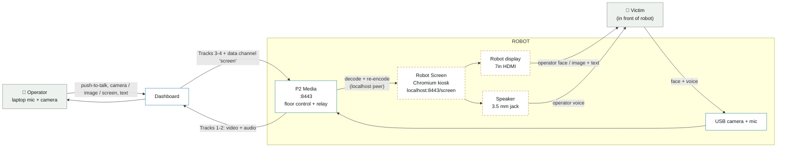
```mermaid
flowchart LR
    operator["🧑 Operator<br/>laptop mic + camera"]
    victim["🧍 Victim<br/>(in front of robot)"]

    subgraph robot["ROBOT"]
        cam["USB camera + mic"]
        p2["P2 Media<br/>:8443<br/>floor control + relay"]
        screen["Robot Screen<br/>Chromium kiosk<br/>localhost:8443/screen"]
        disp["Robot display<br/>7in HDMI"]
        spk["Speaker<br/>3.5 mm jack"]
    end

    dash["Dashboard"]

    victim -- "face + voice" --> cam --> p2
    p2 -- "Tracks 1-2: video + audio" --> dash --> operator
    operator -- "push-to-talk, camera / image / screen, text" --> dash
    dash -- "Tracks 3-4 + data channel 'screen'" --> p2
    p2 -- "decode + re-encode<br/>(localhost peer)" --> screen
    screen --> disp -- "operator face / image + text" --> victim
    screen --> spk -- "operator voice" --> victim

    classDef added fill:#fff,stroke:#B7791F,stroke-dasharray:5 4,color:#12181A;
    classDef core fill:#fff,stroke:#2F7C9E,color:#12181A;
    classDef ext fill:#eef2ee,stroke:#7C8A7E,color:#12181A;
    class screen,disp,spk added;
    class cam,p2,dash core;
    class operator,victim ext;
```

Dashed boxes are the victim-facing additions. Messages go through P2's data channel, **never P1**, so
the talk-to-victim feature stays out of the safety-critical command path.

### 14.2 Sequence — operator talks and sends a message

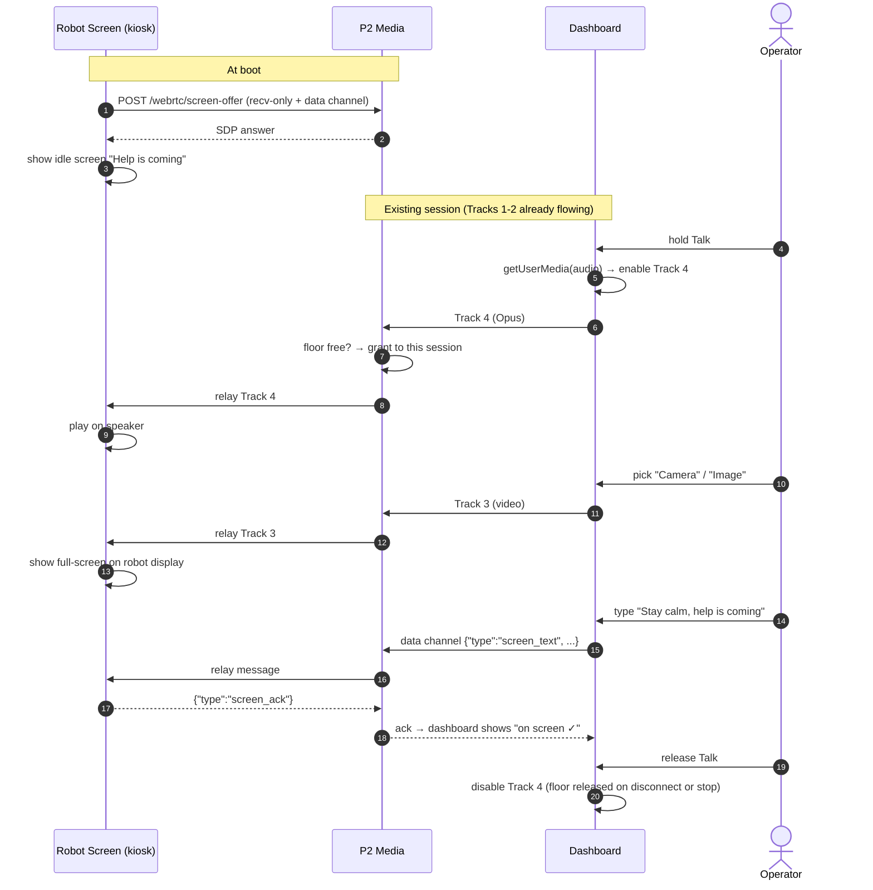
```mermaid
sequenceDiagram
    autonumber
    participant K as Robot Screen (kiosk)
    participant P2 as P2 Media
    participant D as Dashboard
    actor O as Operator

    Note over K,P2: At boot
    K->>P2: POST /webrtc/screen-offer (recv-only + data channel)
    P2-->>K: SDP answer
    K->>K: show idle screen "Help is coming"

    Note over D,P2: Existing session (Tracks 1-2 already flowing)
    O->>D: hold Talk
    D->>D: getUserMedia(audio) → enable Track 4
    D->>P2: Track 4 (Opus)
    P2->>P2: floor free? → grant to this session
    P2->>K: relay Track 4
    K->>K: play on speaker

    O->>D: pick "Camera" / "Image"
    D->>P2: Track 3 (video)
    P2->>K: relay Track 3
    K->>K: show full-screen on robot display

    O->>D: type "Stay calm, help is coming"
    D->>P2: data channel {"type":"screen_text", ...}
    P2->>K: relay message
    K-->>P2: {"type":"screen_ack"}
    P2-->>D: ack → dashboard shows "on screen ✓"

    O->>D: release Talk
    D->>D: disable Track 4 (floor released on disconnect or stop)
```

### 14.3 New failure modes

| Fault | Detection | Response |
|---|---|---|
| Operator denies mic/camera, or page not HTTPS | `getUserMedia` rejects | Talk / camera buttons disabled with reason shown |
| Robot Screen kiosk crashes | Chromium exits non-zero | `robot-screen.sh` relaunches it after 3 s; idle screen returns |
| Display or speaker unplugged | Screen peer connected, no output | Operator sees no ack for messages; pre-mission checklist catches it |
| P2 crash | P3 (existing) | Video **and** talk-to-victim lost; driving unaffected (`DRIVING_LIMITED`) |
| Second operator tries to talk | P2 floor control | Request refused; that session stays listen-only |
| Robot display left in VNC mode | `talk_status.display_mode = "vnc"` | Dashboard shows an orange "robot screen is OFF" warning; P2 restart resets to `robot` |

### 14.4 Display mode — Robot Display ⇄ VNC

**Status: implemented and tested on the robot.** VNC (wayvnc) mirrors the
robot's own display, so the full-screen kiosk also covers the VNC session.
P2 therefore holds a display mode, and `robot-screen.sh` opens or closes the
kiosk to match it.

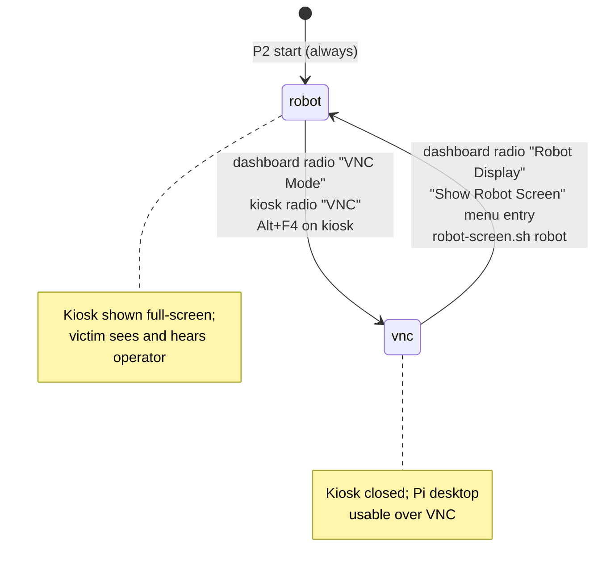
```mermaid
stateDiagram-v2
    [*] --> robot: P2 start (always)
    robot --> vnc: dashboard radio "VNC Mode"<br/>kiosk radio "VNC"<br/>Alt+F4 on kiosk
    vnc --> robot: dashboard radio "Robot Display"<br/>"Show Robot Screen" menu entry<br/>robot-screen.sh robot

    note right of robot
        Kiosk shown full-screen;
        victim sees and hears operator
    end note
    note right of vnc
        Kiosk closed; Pi desktop
        usable over VNC
    end note
```

| Control | Path to P2 | Access |
|---|---|---|
| Dashboard radio buttons (Talk panel) | data channel `{"type":"display_mode","mode":…}` | Any operator session; does not need or claim the floor |
| Kiosk *Hold 3 s for VNC* button (top-left; switches to `vnc` only) | `POST /screen/mode` | Localhost only |
| "Show Robot Screen" menu entry, `robot-screen.sh robot\|vnc` | `POST /screen/mode` | Localhost only |
| Launcher loop | `GET /screen/mode` every 1 s | Opens / closes Chromium |

Every change is broadcast to all dashboards in `talk_status`, so the radio
buttons always show the mode the robot is really in.

A VNC viewer mirrors the robot display, so its clicks and key presses reach
the kiosk too. The kiosk once had one-click radio buttons, and stray VNC
clicks kept closing it mid-conversation; its button now needs a 3-second
press-and-hold and ignores keys. Still, close the viewer while talking to a
victim. P2 logs
which local client switched the mode (`source=local:127.0.0.1:kiosk` or
`:curl`) in the `DISPLAY_MODE` event.

---

*For the full architectural rationale — drivers, quality attributes, known
limitations — see [`SOFTWARE_ARCHITECTURE.md`](./SOFTWARE_ARCHITECTURE.md).
This document is diagram-first and intentionally omits prose already covered
there.*
